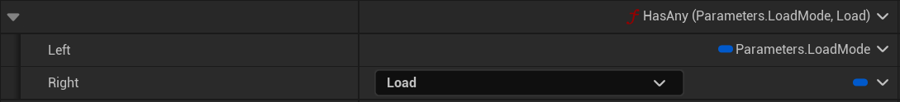
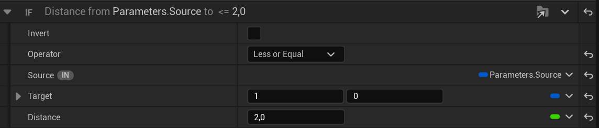
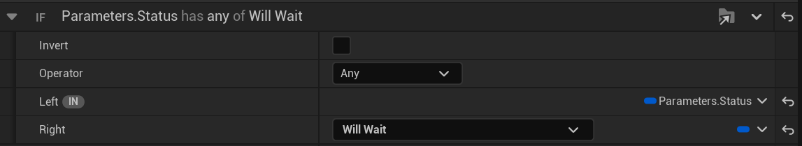

# State Tree Extension

State Tree Extension is a lightweight plugin that adds common missing features for State Trees (Unreal Engine).

If you like Piperift´s work, consider becoming a Patron. It will go a long way in helping us and our projects!

## Features
Keep in mind all features are related to state trees.

- Tasks
  - Add Tag
  - Remove Tag
- Property Functions
  - Vectors
    - Add: FVector, FVector2D, FIntVector & FIntPoint
    - Subtract: FVector, FVector2D, FIntVector & FIntPoint
    - Distance: FVector, FVector2D, FIntVector & FIntPoint
    - Distance Squared: FVector, FVector2D, FIntVector & FIntPoint
  - Gameplay Tags
    - Has Tag
    - Has Any Tags
    - Has All Tags
    - Matches Query
  - Components
    - Get Component Location
  - Enums
    - Has Any: check if the left enum mask has any of the right flags
      
    - Has All: check if the left enum mask has all of the right flags
      
    - Equals: check if the left enum equals the right
      
- Conditions
  - Distance Compare: FVector2D, FIntVector & FIntPoint. (FVector already supported by the engine)
    
  - Flag Compare: check if a flag enum value matches another (Exactly, Any or All)
    